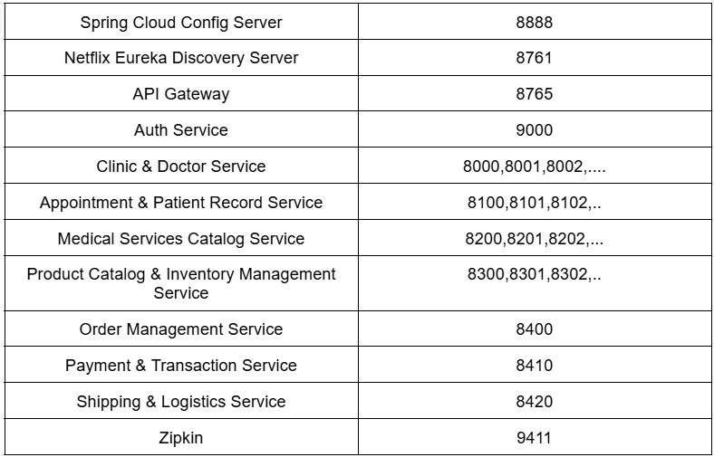

# Clinic E-commerce Backend

A microservices-based backend system for a clinic e-commerce platform, built with Spring Boot and Docker.

## Project Overview

This project implements a distributed system architecture for a clinic e-commerce platform, featuring multiple microservices that work together to provide a complete backend solution.

## System Architecture

The system consists of the following microservices:



## Prerequisites

- Docker and Docker Compose
- Java 21 
- Maven
- PostgreSQL client (optional)

## Environment Variables

Create a `.env` file in the root directory with the following variables:

```env
POSTGRES_USER=your_postgres_user
POSTGRES_PASSWORD=your_postgres_password
JWT_SECRET=your_jwt_secret
```